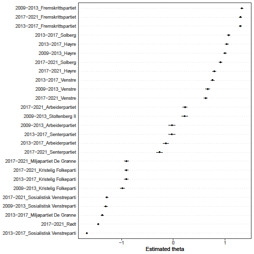

**Knut Arild Hareide og KrF står ikke bare på vippen i Stortinget mellom regjering og opposisjon, de står i en dyp spagat på tvers av det politiske landskap.**

KrF er i en veldig interessant posisjon. De er offisielt i opposisjon etter høstens valg, likevel stemmer de i stor grad sammen med [Solberg-regjeringen](https://www.vg.no/nyheter/innenriks/i/oRQQWm/krf-i-opposisjon-stemmer-sammen-med-regjeringen-i-tre-av-fire-saker). Dette er derimot ikke bare et resultat av at de er et sentrumsparti, posisjonen bygger på underliggende store politiske avstander hvor partiet tilhører både norsk venstre- og høyreside.

En kvantitativ tekstanalyse av norske partiers valgløfter over de tre siste stortingsperiodene ([data fra Holder de ord](https://løfter.holderdeord.no/)) avdekker i stor grad det politiske landskapet slik vi kjenner det, men også med et stort unntak. KrF står nemlig solid plassert langt inne på norsk venstreside, side om side med MDG og kun med SV og Rødt til venstre for seg i inneværende periode.

Denne analysemetoden, kalt [Wordfish](https://onlinelibrary.wiley.com/doi/abs/10.1111/j.1540-5907.2008.00338.x), gir oss partienes posisjoner, tallfestet usikkerhet rundt beregningene samt mulighet for etterprøving. Det gjør også at vi kan følge partienes bevegelser over tid. Der KrF står stødig til venstre over alle disse tre periodene, er det verdt å merke seg at Arbeiderpartiet har bevegd seg mot høyre, og Høyre har bevegd seg mot venstre i inneværende periode. Disse bevegelsene speiler godt Aps frieri til KrF opp mot valget sist høst, og Høyres søken etter å samle borgerlig side i en felles regjering.

I politikken er det riktignok langt flere faktorer som spiller inn enn valgløftene. Blant annet må interne prioriteringer av saker, hvilke partier man søker samarbeid med og partiets velgere tas med i beregningen. Men også der kan det se ut til at KrF trekker mot venstre, noe som har resultert i at KrF har befestet en plassering i sentrum som opposisjonsparti til en regjering utgått av sine nærmeste samarbeidspartnere.

KrFs tilhørighet på norsk politisk venstreside har kommet til syne gjennom kristelig funderte prinsipper som til forveksling minner om klassiske venstresidesaker. Forvalteransvaret går hånd i hånd med miljøsaken, og nestekjærligheten finner sin make i solidaritetstanken som ligger til grunn for blant annet innvandringspolitikk og bistandspolitikk.

Dette viser seg å også gjelde partiets velgere. I valgstudiene fra 2013 og 2009 står KrFs velgere i snitt til venstre på spørsmål om miljø-, innvandrings- og distriktspolitikk, og alle disse områdene er viktige for deres stemmegivning. Ellers holder velgerne seg i en sentrumsposisjon i økonomiske spørsmål, men uten at det er av særlig betydning for stemmegivningen.

Det store dilemmaet har gjerne ligget i KrFs kjerne. Det er moralske/religiøse spørsmål som er viktigst for velgerne, og de står der i en helt unik posisjon til høyre for alle partier. Det er disse spørsmålene som gjerne gir en ryggmargsrefleks mot samarbeid hos velgere og partier på venstresiden, abort, homofiles rettigheter, kristendom i skolen. Men forrige periode viste at slike saker ikke er noe særlig enklere å få gjennom blant de borgerlige, best eksemplifisert ved ståheien rundt forslaget om reservasjonsretten.
Samtidig som en stor del av KrFs politikk hører hjemme på venstresiden kan det spørres om ikke også mange av kjernesakene best kan ivaretas der. Med to uttalte liberale partier blant de borgerlige i Venstre og FrP, står KrF for en kamp i oppoverbakke om saker som nei til søndagsåpne butikker og en restriktiv alkoholpolitikk. Begge disse sakene, og flere med, har KrF flertall for blant sine meningsfeller på venstresiden.

KrF står i dag på vippen i norsk politikk, som uttalt opposisjonsparti med en fot i begge leirer. Partiets historiske og verdimessige tyngdepunkt har ligget til høyre, men politikken som helhet og fremtiden selv ligger muligens til venstre.
