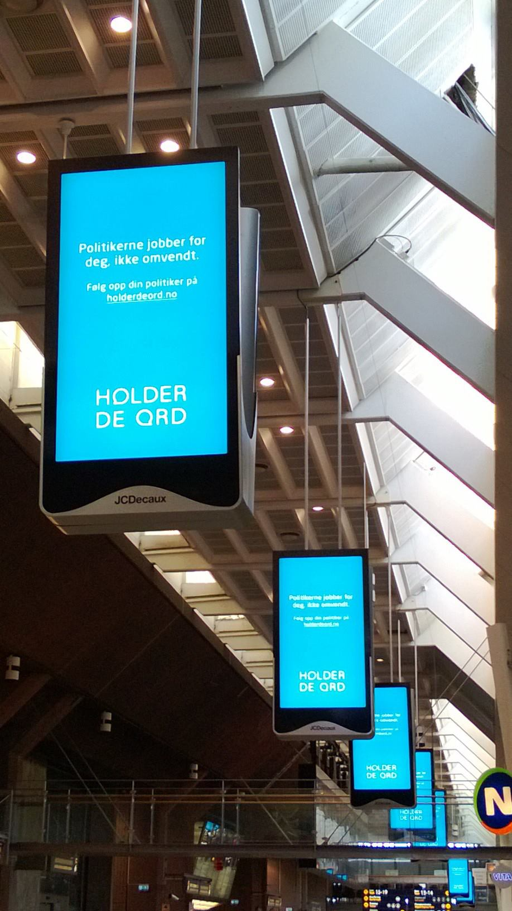
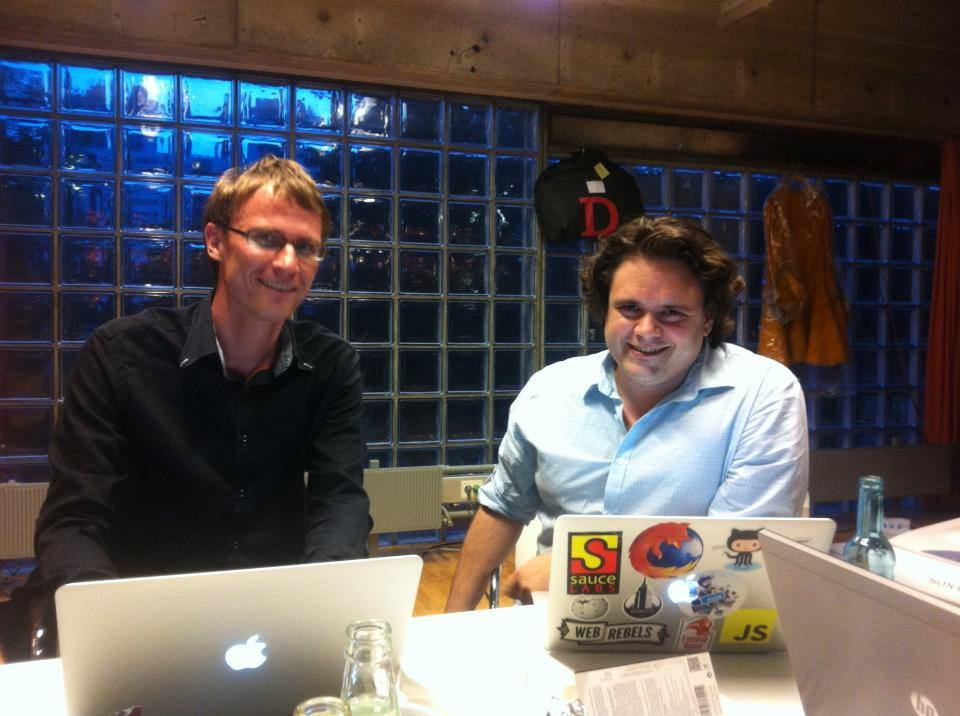
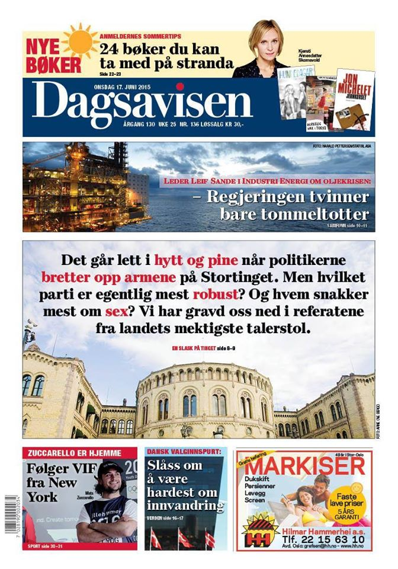
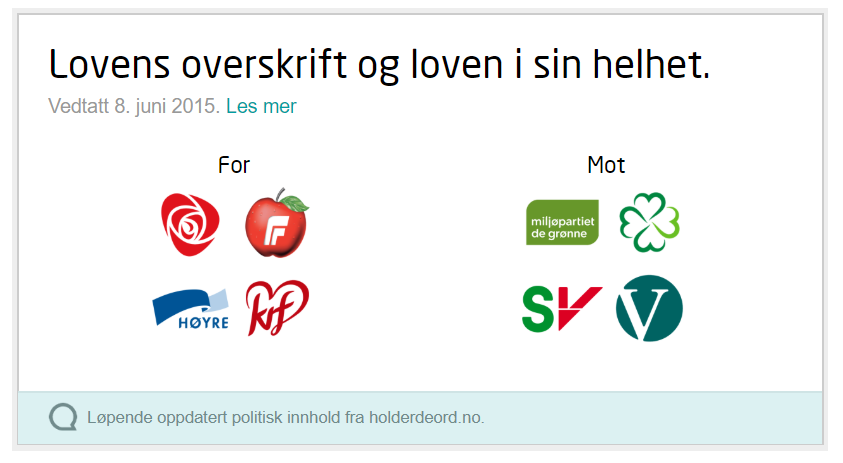
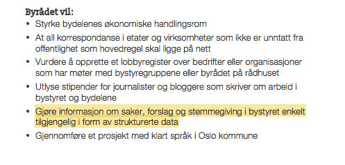
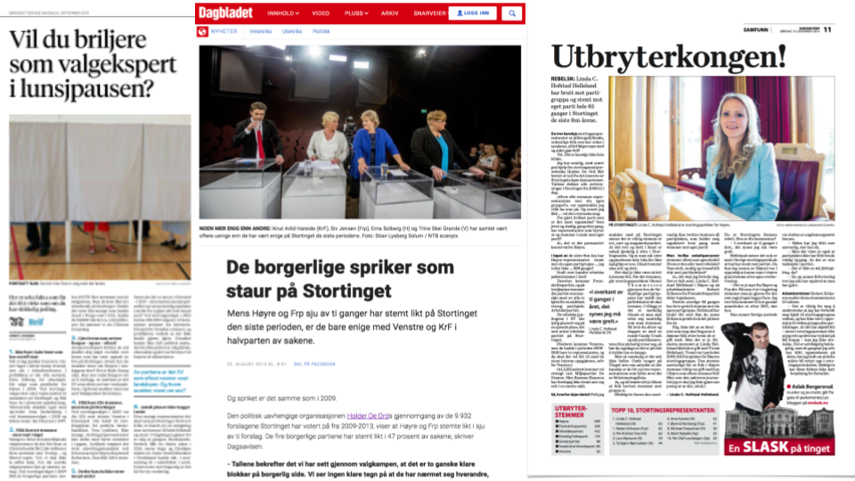
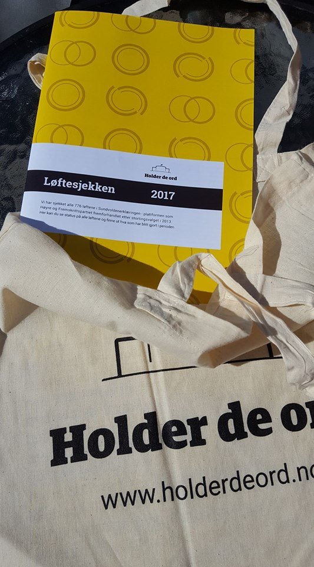

**Holder de ord ble stiftet i 2010 av en gruppe idealister og nerder. Nye idealister og nerder har kommet til i årene etter. Vi er fortsatt idealister og nerder, men i 2020 kaster vi inn håndkleet. I løpet av 2020 vil Holder de ord bli lagt ned.**

Når Holder de ord startet opp i 2010 fantes ikke faktisk.no. Ordet faktasjekk var ikke allemannseie. Hvis du ville vite hvordan politikere og partier stemte på Stortinget måtte du troppe opp på Stortinget for å bla i utskriftsbunker. Partiene publiserte sine partiprogram som pdf-versjoner av word-dokumenter. Spoiler alert: Det gjør de fortsatt. Dessverre. Og det er fortsatt ikke alltid like enkelt å finne ut hva som er flås eller fakta når man hører politikere snakke, men vi liker å tro at vi har gjort en liten, men viktig forskjell i den politiske debatten det siste tiåret. At vi har gjort det litt vanskeligere å komme unna med påstander som ikke stemmer. At politikere kanskje har skjerpet seg bittelitt. At de kanskje holder litt mer ord. Det er i alle fall lov å håpe.

Når vi nå kaster inn håndkleet, skal vi gjøre det gjennom å feire alle de fantastiske tingene vi har fått til. Holder de ord har sannsynligvis vært et av Norges mest avanserte hobbyprosjekter, og vi har hatt det vanvittig morsomt de ti årene vi har holdt på. Slutten burde ikke være noe annerledes, og lysene slukkes derfor med en stor fest. Vi har satt sammen en uhøytidelig samling av det vi mener er våre “greatest hits” og det vi selv husker best fra det tiåret vi holdt hjulene i gang og Holder de ord holdt ord.

Og for de som synes dette er altfor trist, så kan vi trøste med at kildekoden til Holder de ord er tilgjengelig for alle og enhver på Github (hint, hint). Den som skriver en snill e-post til oss kan sikkert også få tak i dataene våre. Vi heier på alle som jobber for mer åpenhet og mer fakta i politikken, åpne data og åpen kildekode!

### Greatest hits

I 2012 vant Holder de ord Reklame for Alvor, en bransjepris som ga oss en gratis reklamekampanje verdt millioner. Plutselig var vi på alle reklameplakater i hovedstaden og i interiørblader ingen av oss leste.  I 2012 fikk vi også vår første forside i en riksdekkende avis. Vi gikk høyt ut: Sto foran Stortinget og lovte å avsløre løftebrudd i politikken.

I forbindelse med valget 2013 inngikk vi et redaksjonelt samarbeid med NRK og bidro med voteringsdata til NRKs politiske saker. Her svarte vi på spørsmål fra seere under NRKs valgvake og den siste partilederdebatten før valget. Svett, men god stemning! 

I 2014 publiserte vi vårt mest delte og leste [blogginnlegg](https://blog.holderdeord.no/2014/12/10/hvilke-aviser-leser-politikerne/) noensinne om hvilke aviser og medieaktører som oftest ble sitert på Stortinget. Flere aktører har i etterkant laget lignende saker. Det samme året laget vi [Partipisken](https://twitter.com/partipisken), en automatisk twitter-tjeneste som tvitrer hver gang en Stortingsrepresentant stemte mot sitt eget parti på Stortinget. Flere politikere fikk ikke med seg at dette var en automatisk tjeneste som hentet data rett fra Stortinget, og gikk i forsvarsmodus med mer eller mindre hyggelige tvitringer tilbake om at de ikke hadde vært til stede på Stortinget, hadde trykket feil, eller at det umulig kunne stemme. Vi koste oss uansett. Billig moro, kanskje, men man tar det man får. Senere viste det seg at all feiltrykkingen hadde resultert i at [et forslag som skulle fått flertall og således blitt vedtatt, i stedet ble stemt ned](https://blog.holderdeord.no/2015/06/12/nedstemt-med-falskt-flertall/).

I 2015 var vi ordentlig travle. Vi lagde på moro [en video om når Stortingssalen lo](https://blog.holderdeord.no/2015/03/16/dette-er-stortingets-morsomste/). Tørr humor, men barnslig gøy likevel. Lite ante vi at VG skulle snappe opp videoen og gi den langt flere seere enn vi kunne drømme om. Det var kanskje ikke den saken vi ønsket at media skulle plukke opp, men som sagt: Man tar det man får.

I 2015 lanserte vi også referatsøket “Sagt i salen”. Noen av oss havna på [NRK Dagsrevyen](https://www.nrk.no/norge/disse-uttrykkene-bruker-politikerne-mest-1.12414250) samme dag, og tjenesten ble viet en forside i en riksdekkende avis. Pressen fant fort ut at KrF var det partiet som snakket mest om sex fra Stortingets talerstol.  I ettertid har Rødt slått KrF som det mest sexfikserte partiet på Stortinget. I forbindelse med lanseringen skrev Are Kalvø i [Aftenposten](https://www.aftenposten.no/meninger/i/wXdn/kalvoe-president-eg-er-rar-paa-haaret) at det hadde “blitt lansert ei teneste på nettet til glede for alle som lever ekstremt fattige liv med mykje fritid og få sunne interesser.” Mulig han hadde rett hvis man ser på hva Norge har søkt på. En fireåring med tiss, bæsj og promp på hjernen ville nikket anerkjennende til listen for mest søkte ord.

Resten av 2015 holdt vi fanen høyt for åpenhet og offentlighet. Vi skrev et blogginnlegg som gikk viralt om at Stortinget hadde stemt for å innskrenke offentlighetsloven i kommuner og fylkeskommuner. De fleste på Twitter leste nok ikke saken, men vi tror de likte bildet vi delte.  Høsten 2015 ble vi spurt om hva vi mente burde stå i byrådserklæringen for det nye rødgrønne byrådet i Oslo. Vi svarte “publisere vedtak som åpne, strukturerte data” uten å nøle. Vips så hadde det havnet i erklæringen. . Hvem mente politisk påvirkning var vanskelig, liksom? Men holdt byrådet ord? Nei. Et gedigent løftebrudd der, altså. Det hjalp ikke at vi skrev mer eller mindre det samme i en [kronikk på NRK](https://www.nrk.no/ytring/apne-radhusene-for-folket-1.12612254).

Månedene gikk til å svare på stadig flere henvendelser fra journalister. Kunne vi gjøre det eller det, kunne vi kjøre ut ditt eller datt, og kunne vi fortelle hvilken Stortingsrepresentant som hadde gjort mest eller minst av det ene eller det andre? Helst for fem minutter siden. De beste oppga oss som kilde, mens andre “glemte det” eller skyldte på desken (you know who you are!). Vi var så idealistiske og (dum?)snille at vi ikke en gang tok betalt for moroa. Det ble en del gode mediesaker, da. 

I 2016 lanserte vi [enighetsstatistikken](https://enighet.holderdeord.no/) som viser hvilke partier som stemmer sammen på Stortinget og på hvilke temaer. Denne tjenesten fanget alle nerder og kverulanter. Tenketanker med en politisk slagside kastet seg over materialet. Mange ble nok skuffet over det de fant eller ikke fant.

I 2017 fikk vi drahjelp fra Fritt Ord i form av et tilskudd (takk, Fritt Ord!), og planla hva vi skulle gjøre under valget. Noe stort skulle det uansett være. Og vi logget valgløfter inn i vår Løftebase, en database over alle valgløfter fra partiprogrammer og regjeringserklæringer. Manuelt. Klipp og lim til du blør. 8208 nye valgløfter for perioden 2017-2021 skulle legges inn i vår database, manuelt, siden alt ble publisert som word-filer. I tillegg til de cirka tusen løftene i Jeløya-erklæringen etter valget. Vi grøsser bare vi tenker på det. Og sorry, nei, vi har ikke lagt inn Granavolden-erklæringen, vi har ikke orket tanken. Våre formaninger i 2017 i NRK om at partiene lovte for mye til velgerne ([for mange valgløfter rett og slett!](https://www.nrk.no/ytring/for-mange-valglofter-1.13664725)) falt for døve ører.

Sommeren 2017 lanserte vi vår fullstendige [løftesjekk av regjeringen](https://sjekk.holderdeord.no/). Mens [Aftenposten](https://www.aftenposten.no/norge/politikk/i/zq7J1/slik-gikk-det-med-solberg-regjeringens-loefter) kom oss i forkjøpet, lot vi vår løftesjekk modnes frem til starten av Arendalsuka. Kan hende Aftenposten hadde litt for mye hastverk siden de kun fant 200 løfter i Sundvolden-erklæringen, mens vi fant hele 776. Et sinnsykt stykke arbeid som lot oss definere dagsorden en liten stund, og som har blitt kopiert flere ganger av mediehus og visstnok også av sittende politikere (har vi hørt!). 

Når vi nå gir oss er det på grunn av sammensatte grunner. Vi var alle slitne etter valget i 2017 og trengte en pause. Den pausen var nødvendig og ble kanskje litt for lang. Flere av oss har holdt på i ti år, og har i mellomtiden fått familier og mer krevende jobber. Og kanskje har tiden også løpt litt fra prosjektet slik det står nå - flere mediehus har tydelig blitt inspirert av det vi har gjort, nye og komplementerende tjenester har dukket opp, og Stortinget har blitt langt flinkere til å dele det som skjer på Løvebakken med omverdenen. Det er flere morsomme historier vi kunne delt, og mange morsomme (og sinte og stygge) e-poster fra politikere vi kunne vist fram. Men dette får holde. Vi nøyer oss med å si: Takk for nå!
